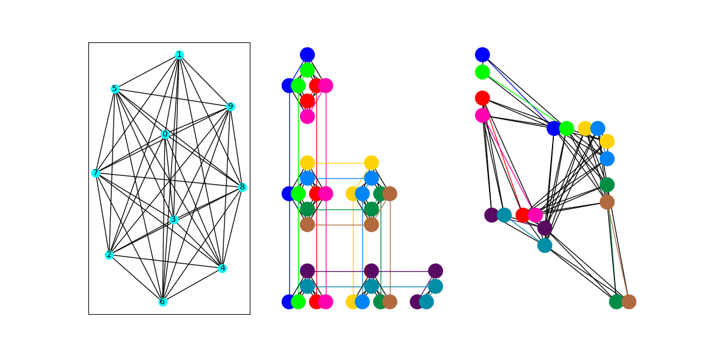
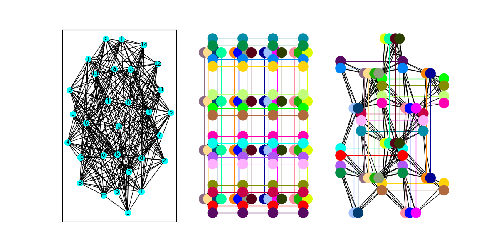

# Exploring the Pegasus Topology

D-Wave's Advantage quantum computer implements a chip topology called Pegasus.
The programs in this folder provide a few different ways to explore the qubits
and embeddings possible with Advantage.  For a full technical description of
the Pegasus topology, see [our whitepaper](https://dwavesys.com/sites/default/files/14-1049A-A_The_D-Wave_Advantage_System_An_Overview_0.pdf).

## Program Descriptions

Here we describe each program in this directory. Note that although these
programs are not running any problems on the QPU, they will require a token
that has access to an Advantage solver since the query the properties of the
online solvers.

#### `get_props.py`

Prints the properties of the online system that uses the Pegasus topology.

#### `get_available_qubits.py` 

Provides information on the available qubits that can be programmed in the
online Advantage system. 

#### `get_inactive_qubits.py` 

Each time a chip is calibrated, a small number of qubits may not perform within
our required specifications. These qubits become inactive, and cannot be used
in your calculations. This program will show the number of inactive qubits in
the online Advantage system.

#### `clique_embedding.py`

Look at how cliques (or complete graphs) can be embedded on the Pegasus
topology. 

To run this program, type `python clique_embedding.py N`, where N is a positive
integer. The program will attempt to embed a clique of size N onto a full P16
(the Pegasus topology at the scale of the Advantage chip).

For example, running `python clique_embedding.py 10` will produce the image
shown below.

#### `biclique_embedding.py`

Look at how bicliques (or complete bipartite graphs) can be embedded on the
Pegasus topology.

To run this program, type `python biclique_embedding.py N`, where N is a
positive integer. The program will attempt to embed a biclique of size N by N
onto a full P16 (the Pegasus topology at the scale of the Advantage chip).

For example, running `python biclique_embedding.py 15` will produce the image
shown below.

